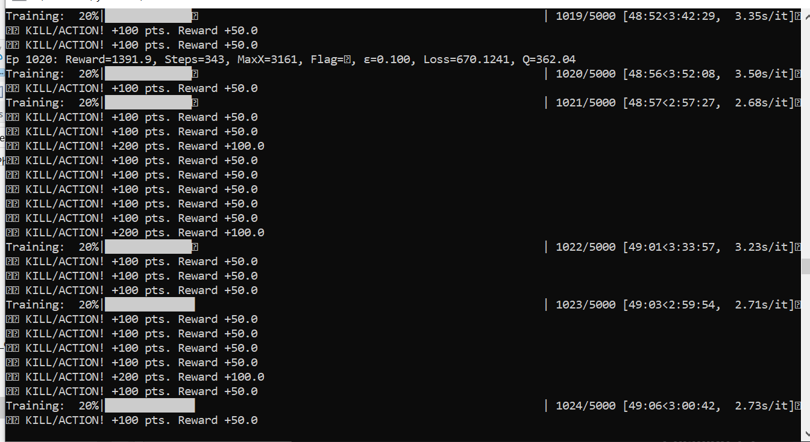
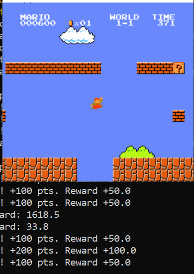

# Super Mario RL + 3D Neural Visualization 🍄🧠

> **"What do you do for a living? I teach AIs to play Mario."**

This project demonstrates a Reinforcement Learning agent (DQN) learning to play **Super Mario Bros** on the NES. 

Unlike standard black-box AI demos, this project features a **Real-Time 3D Neural Network Viewer** that runs in your web browser, allowing you to see exactly what the agent "sees" and "thinks" as it plays.

 

 
## Features

*   **Deep Q-Network (DQN):** Trained using PyTorch with a customized reward function.
*   **Live 3D Visualization:** A Three.js web viewer connected via WebSockets to the Python backend.
*   **"Aggressive Mode"**: The agent is rewarded heavily for defeating enemies and breaking blocks, creating a proactive playstyle.
*   **Educational Overlay**: Inputs are labeled in Spanish (*"Enemigo"*, *"Suelo"*, *"Pared"*) to help students visualize the data flow.
*   **Optimization**: Renders at 60 FPS using staggered geometry updates and instanced rendering.

## Quick Start

### 1. Install Dependencies
Double-click `install_dependencies.bat` OR run:
```bash
pip install -r requirements.txt
```

### 2. Start Training (with Visualization)
Run the training script. This launches the game window and the WebSocket server.
```bash
python train_mario.py
```
*Note: Make sure you are in your virtual environment if you use one.*

### 3. Open the 3D Viewer
Open the `alone/general.html` file in your preferred web browser (Chrome/Edge/Firefox).
```
file:///path/to/mario-rl/alone/general.html
```
You should immediately see the neural network lighting up and reacting to Mario's movements in real-time!

## Controls (Web Viewer)
*   **Left Click + Drag**: Rotate camera
*   **Right Click + Drag**: Pan camera
*   **Scroll**: Zoom
*   **Minimize Button (_)**: Hide UI for a cinematic view

## Technology Stack
*   **Backend**: Python, PyTorch, Gym-Super-Mario-Bros, NES-Py
*   **Frontend**: JavaScript, Three.js, WebSockets
*   **Communication**: Asyncio + Websockets

---
*Created for a customized "Career Day" presentation to inspire engineering students in Mexico.* 🇲🇽
